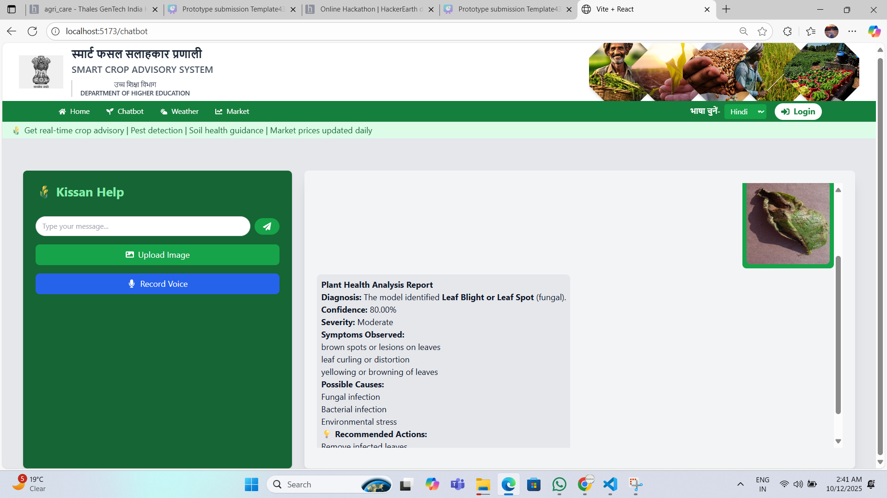
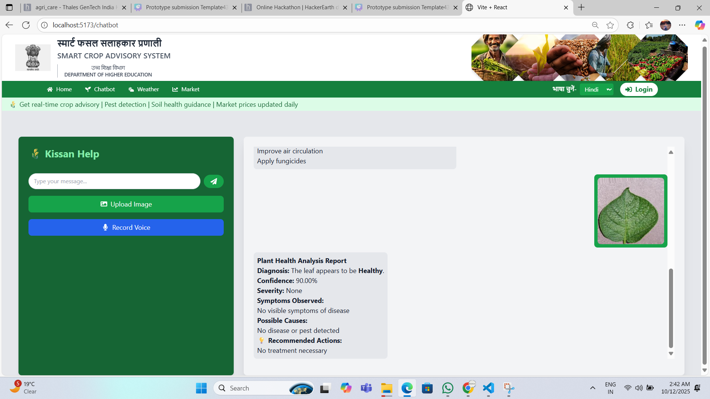
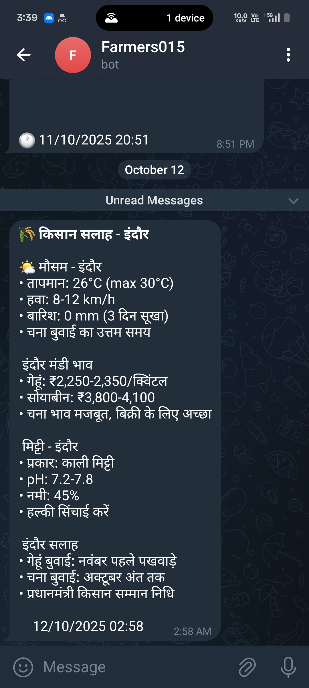

# 🌾 AgroSecureAI Agents

*AI-Powered Secure Agriculture Assistant*

*Team:* AgroTech | Acropolis Institute of Technology and Research, Indore  
*Hackathon:* Thales GenAI Hackathon 2025

---

##  Project Overview

AgroSecureAI Agents is an AI-powered, secure, and multilingual agricultural assistant designed to empower farmers with real-time, context-aware, and privacy-preserving solutions.

Using Vision + Language + Agent-based Intelligence with *LangChain* & *LangGraph*, our system detects crop diseases, provides personalized treatment recommendations, gives weather and soil insights, and ensures farmers' data privacy — all in one unified, interactive platform.

---

##  Key Idea

To build an AI Agent ecosystem that acts like a smart "Digital Krishi Sahayak" — a single intelligent platform that can:

- *See* (via vision model – LLaMA 4 with vision)  
- *Think* (via reasoning-based LLM with LangChain)  
- *Act* (via coordinated sub-agents using LangGraph for tasks like soil, weather, market, and treatment)

---

##  Core Features

### 1.  Real-time Crop Disease Detection
- Powered by *LLaMA 4 Vision model*, capable of identifying pests and diseases directly from leaf images  
- Rejects irrelevant images with helpful guidance

### 2.  Treatment Recommendation System
- Suggests both *organic* and *chemical treatments* using LangChain reasoning  
- Dynamic treatment generation without database dependency

### 3. 🌦 Smart Agricultural Agents with LangGraph
- *Soil Agent:* Crop suggestions based on soil type  
- *Weather Agent:* Real-time weather info via OpenWeather API  
- *Market Agent:* Displays local mandi prices through LangGraph workflows

### 4. 🎙 Voice Interaction (Multilingual)
- Farmers can ask queries in natural language via *OpenAI Whisper*  
- Integrated with LangChain for seamless voice processing

### 5. 🧩 Short-Term Memory Integration
- *LangChain memory management* for contextual conversations  
- Remembers last crop or disease discussion using session memory

### 6. 🔐 Secure Infrastructure
- Uses *JWT authentication, **AES encryption, and **HTTPS* for full data protection  
- LangChain secure prompt management

### 7. ☁ Scalable Deployment
- *Frontend:* React  
- *Backend:* FastAPI with LangChain/LangGraph integration

---

## 🛠 Technical Architecture

*Frontend*
- Framework: React  
- Styling: Tailwind CSS  
- Build Tool: Vite

*Backend*
- Framework: FastAPI  
- AI Orchestration: LangChain + LangGraph  
- Authentication: JWT  
- Encryption: AES

*AI/ML Components*
- Vision Model: LLaMA 4 with vision capabilities  
- Voice Processing: OpenAI Whisper  
- Agent Framework: LangChain for agent creation  
- Workflow Management: LangGraph for agent orchestration  
- Memory Management: LangChain memory modules

*APIs & Services*
- Weather Data: OpenWeather API  
- Market Price:Real time web search  


```
## 📁 Project Structure


# Thales_Genail_AgriTech Folder Structure

Thales_Genail_AgriTech/
├── backend/
│   ├── notifications/
│   ├── Potato/
│   ├── _pycache_/
│   ├── .env
│   ├── .gitignore
│   ├── daily_scheduler.py
│   ├── debug_notifications.py
│   ├── image_agent.py
│   ├── location_agent.py
│   ├── main.py
│   ├── market_agent.py
│   ├── requirements.txt
│   ├── soil_agent.py
│   ├── tempCodeRunnerFile.py
│   ├── test.py
│   ├── test_imageupload_agent.py
│   ├── test_location_agent.py
│   ├── test_market_prices.py
│   ├── test_soil.py
│   ├── test_weather.py
│   ├── utils.py
│   ├── weather_agent.py
│   ├── whatspp_test.py
│   ├── workflow_test.py
│   └── _init_.py
├── frontend/
│   ├── node_modules/
│   ├── public/
│   ├── src/
│   ├── .env
│   ├── .gitignore
│   ├── eslint.config.js
│   ├── index.html
│   ├── package-lock.json
│   ├── package.json
│   ├── postcss.config.js
│   ├── README.md
│   ├── tailwind.config.js
│   └── vite.config.js
└── README.md


Setup Instructions

1️⃣ Clone Repository

https://github.com/alokkumar0987/Thales_Genail_AgriTech.git
cd Thales_GenAI_AgriTech


# Backend Setup
cd backend
pip install -r requirements.txt
# Set up environment variables in .env
# Start the FastAPI server
uvicorn main:app --reload


# Frontend Setup

cd frontend
npm install

# Set up environment variables in .env
# Start the development server
npm run dev

```

# Project Title

A short description …

## Demo Video

[](https://youtu.be/1U8Eqyvgx7Y)
> Click the image above to watch the demo video.


## 📸 Screenshots

<p align="center">
  
  
  
</p>

<p align="center">
  
  
</p>

---

## How to Run

… (installation & usage instructions)


👥 Team Members

Name	Role

Alok kumar:	AI/ML Engineer & Backend Lead
Abhinav Upadhyay:Backend developer
Ajay Sahani: Frontend Developer
Anushka Kashiv: Documentation & Presentation


📨 Contact

📧 Email:alok33778@gmail.com
🔗 GitHub: https://github.com/alokkumar0987/Thales_Genail_AgriTech.git


